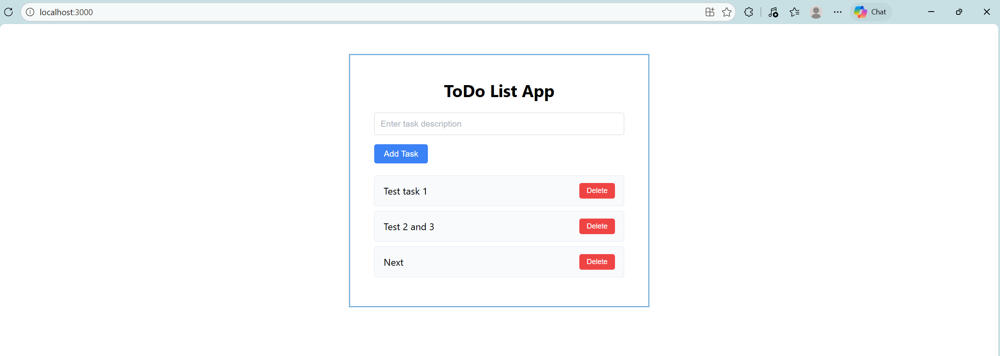

# ToDo List App

This is a simple ToDo List application built with React. Users can add tasks, view the list of tasks, and delete tasks as needed.

## Design

### 1. Input

There are three interactions that can be made by the user:

- **Input Task**: Type a task description into the input field.

- **Add Task**: Click the "Add Task" button to add the task to the list.

- **Delete Task**: Click the "Delete" button next to a task to remove it from the list.

### 2. Process

- When the user types a task description into the input field, the application updates the state to reflect the current input value.

- When the user clicks the "Add Task" button, the application makes sure that the input is not empty, then add the task to the list and clear the input field.

- When the user clicks the "Delete" button next to a task, the application removes that task from the list.

### 3. Output

- The frontend display an input field for entering task descriptions, an "Add Task" button, and a list of tasks with "Delete" buttons next to each task.

- CSS is used to style the application, making it visually appealing and user-friendly.

