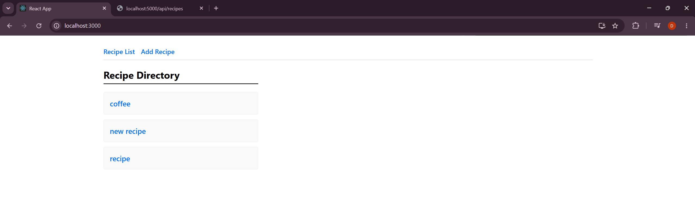
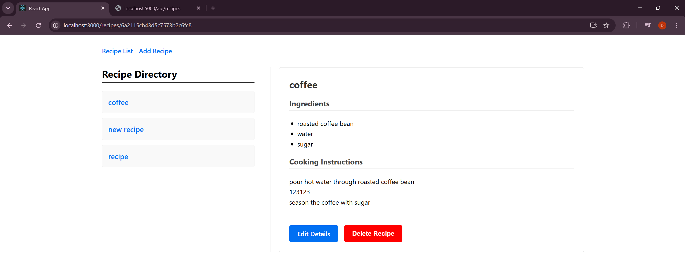
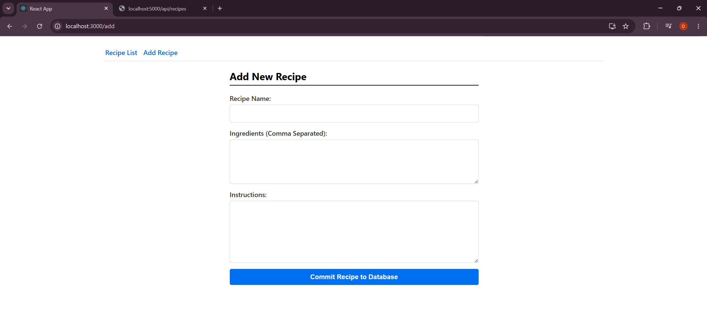
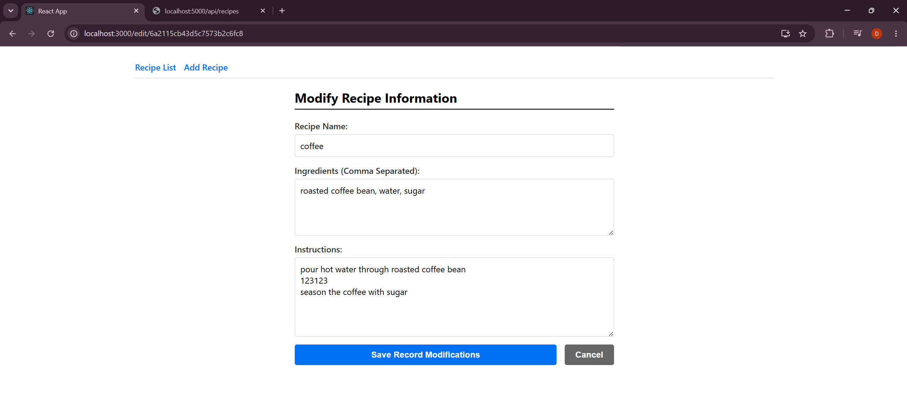
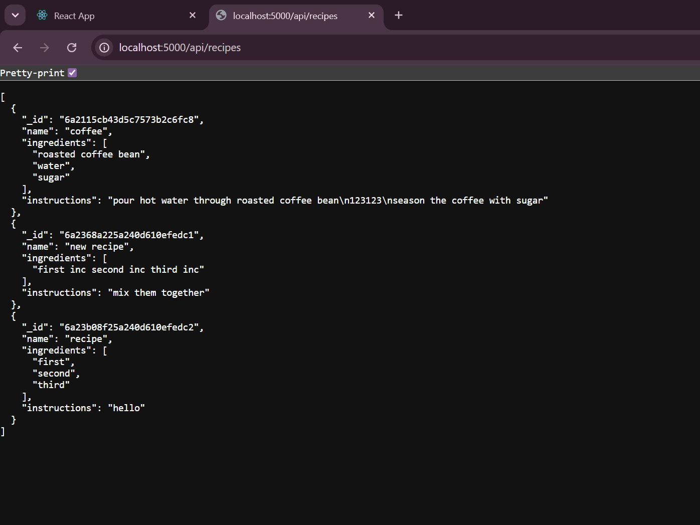

# Input
The client can perform add, update or delete operations on the recipe records. Adding a new recipe requires the user to provide a name, a list of ingredients, and instructions. Updating an existing recipe allows the user to modify any of those fields. Deleting a recipe would require confirmation from the user before the record is removed from the database. 

# Process
User's client-side operations trigger API calls to the backend server, which then interacts with the database to perform the requested CRUD operations. The frontend is built using React. React Router is used to manage navigation between different pages (list, details, add, edit). The backend is built using Node.js and Express. MongoDB is used as the database to store recipe records. 

# Output
The application has a clean and intuitive user interface that allows users to easily manage their recipes. 

# Requirements

1. Use React Router for implementing the different routes in your application.
React Router is implemented in the `App.js` file to define the routes for the recipe list, details, add, and edit pages.

2. Set up a back end using Node.js, Express, and MongoDB Atlas to store and manage recipe data.
All backend stacks are installed and present in backend/package.json. Implementation of Express can be found in backend/server.js. Implementation of MongoDB can be found in backend/db.js

3. Utilize the MongoDB Node.js driver to interact with the database for adding, updating, and deleting recipes.
CRUD operations are implemented in backend/routes/recipeRoutes.js using the MongoDB Node.js driver.

4. Apply your own styling to make the application visually appealing and user-friendly.
Styling is implemented in frontend/src/App.css and frontend/src/index.css. The application also use dynamic class names to apply different styles to different components.

5. Organize your components and files in a structured manner for clarity.
- In the backend folder, there are three files handling different aspects of the application: server.js for setting up the Express server, db.js for connecting to MongoDB, and routes/recipeRoutes.js for defining the API routes. 

- In the frontend folder, there are separate files for each page (RecipeListPage.jsx, RecipeDetailsPage.jsx, AddRecipePage.jsx, EditRecipePage.jsx) and a main App.js file that defines the routes and layout of the application.

# Snapshots of the application

1. Recipe List Page

2. Recipe Details Page

3. Add Recipe Page

4. Edit Recipe Page

5. Backend page

